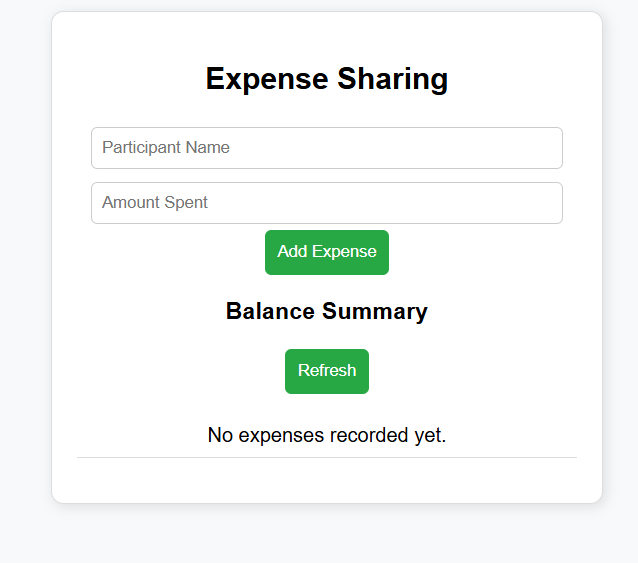
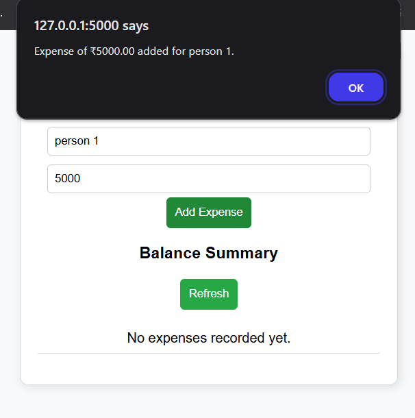
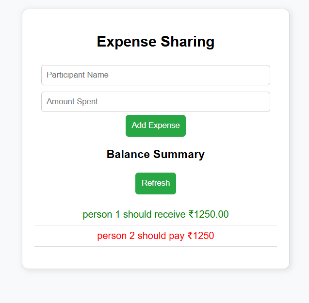

### TASK 1: 

# **Expense-Sharing System**  

A simple and interactive **Python-based command-line application** for tracking shared group expenses. This tool calculates how much each participant **owes or is owed** to fairly distribute costs. Perfect for **friends, roommates, and travel groups**!  

## **Features**  
- **Add Participants**: Input names and record expenses.  
- **Automatic Balance Calculation**: Determines how much each person owes or is owed.  
- **User-Friendly CLI**: Simple text-based interface with easy navigation.  
- **Error Handling**: Prevents missing names, invalid amounts, or negative expenses.  

## **Technologies Used**  
- **Python**: Core logic for calculations and command-line interaction.  

## **How to Run**  
1. Clone the repository to your local system:  
   ```bash
   git clone https://github.com/pratham003/expense_sharing_cli.git
   ```
2. Navigate to the project folder:  
   ```bash
   cd expense_sharing_cli
   ```
3. Run the script:  
   ```bash
   python expense_sharing.py
   ```
4. Follow the **on-screen instructions** to:  
   - Add participants  
   - Record expenses  
   - View calculated balances  

## **Example Usage**  
```
Welcome to the Expense-Sharing System!

1. Add participant  
2. Record expense  
3. View balances  
4. Exit  

Enter your choice: 1  
Enter participant name: Alice  

Enter your choice: 2  
Enter participant's name: Alice  
Enter amount spent: 500  

Enter your choice: 3  
Balances:  
- Alice paid ₹500 and owes ₹0  
```

## **Future Enhancements**  
- **Persistent Data Storage**: Save and load expenses across sessions.  
- **Custom Splitting**: Allow users to divide expenses by specific percentages.  
- **Export Reports**: Generate CSV or PDF summaries.  

## **Demo**  

Experience a simple and effective way to **split group expenses** through a lightweight and user-friendly interface.  

### **Interface Overview**  


### TASK 2:

# **Expense-Sharing Web App**  

An intuitive **web-based application** built using **Flask, HTML, CSS, and JavaScript** to simplify group expense management. Users can **add participants, record expenses, and view balances** dynamically through a clean and interactive dashboard.  

## **Features**  
- **User-Friendly Interface**: Input participant names and expenses via an interactive form.  
- **Real-Time Dashboard**: Displays how much each person **owes or is owed** instantly.  
- **Automated Calculations**: Fairly splits expenses among participants.  
- **Persistent Storage**: Uses **SQLite** to save and retrieve expense records.  
- **Error Handling**: Prevents missing fields and invalid inputs.  

## **Technologies Used**  
- **Flask (Python)**: Backend API for managing expense logic.  
- **SQLite**: Database to store expenses.  
- **HTML, CSS, JavaScript**: Frontend for a responsive and engaging user experience.  

## **How to Run**  
1. Clone the repository to your local system:  
   ```bash
   git clone https://github.com/pratham003/expense_sharing_web.git
   ```
2. Navigate to the project folder:  
   ```bash
   cd expense_sharing_web
   ```
3. Install dependencies:  
   ```bash
   pip install flask
   ```
4. Start the Flask server:  
   ```bash
   python app.py
   ```
5. Open **http://127.0.0.1:5000/** in your browser and start managing expenses!  

## **Example Usage**  
1. **Enter participant names and amounts spent.**  
2. **Click "Add Expense"** to record the expense.  
3. **View balances** on the dashboard to see how much each participant owes or is owed.  

## **Future Enhancements**  
- **User Accounts**: Login system to track personal expense history.  
- **Multiple Groups**: Manage expenses separately for different groups.  
- **Graphical Analysis**: Add pie charts and reports for better insights.  

## **Demo**  

Experience a simple and efficient way to **split group expenses online** through a seamless and responsive web application.  

### **Interface Overview**  





---

Contributions, forks, and feedback are **highly encouraged**! 🚀


---

Contributions, forks, and feedback are **highly encouraged**! 🚀
